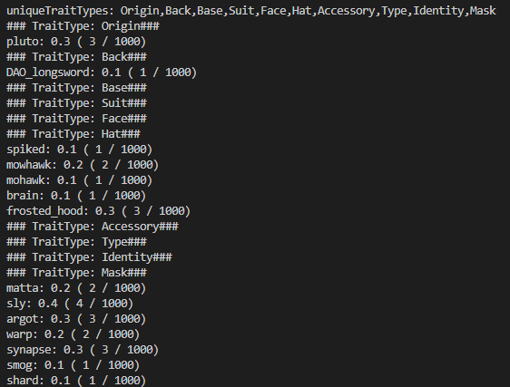

# Introduction
This Project helps you identify rare NFTs shortly after reveal of a collection.
It uses your defined IPFS Gateways.
As the output you will get the top100 NFTs of a collection.
This output can be used to insert into the Opensea API to check if one of the top100 is listed for cheap.  

# Getting Started

## Nodejs
npm install

## Config file
Define your Projects and the IPFS Gateways you want to use in the config.json file.
### projects
example: 
```json
  "projects": [
    {
      "name": "metaheros",
      "url": "QmXdVyGUhqRVx9iJ5zv7D54cc2pLcpiGRRqnoDMkQWDCCz",
      "isIpfs": true,
      "urlVariant": 1,
      "traitJsonType": 1,
      "traitWeights": [
        { "key": "Identity", "weight": 2 },
        { "key": "Origin", "weight": 1.5 }
      ]
    }
```
`name`: Your Project Name. Db will be saved to this file e.g. db/metaheros.db

`url`: url of token metadata

`isIpfs`: false if MetaData is on a non IPFS Endpoint

`urlVariant`: 
1=ipfs/QmXdVyGUhqRVx9iJ5zv7D54cc2pLcpiGRRqnoDMkQWDCCz/tokenId 
2=ipfs/QmXdVyGUhqRVx9iJ5zv7D54cc2pLcpiGRRqnoDMkQWDCCz/tokenId.json

`traitJsonType`:
1: Metadata has this kind of structure
```json
{
	"name": "MetaHero #1",
	"attributes": [
		{
			"trait_type": "Origin",
			"value": "jupiter"
		},
		{
			"trait_type": "Base",
			"value": "whiteout"
		}
	]
}
```
2: Metadata has this kind of structure
```json
{
	"name": "Cryptorunner #1",
	"attributes": {
		"Faction": "The Punks",
		"Base Model": "Punk 2"
	}
}
```

`traitWeights`:
Fine-tune your rarity scores with weights. For example if asthetics of a certain trait is more important

### IPFS Gateways
example:
```json
  "ipfsGateways": [
    "https://gateway.pinata.cloud/ipfs/",
    "https://ipfs.io/ipfs/",
    "https://cf-ipfs.com/ipfs/",
    "https://gateway.ipfs.io/ipfs/",
    "https://hardbin.com/ipfs/"
  ]
```
The more the faster the script will run through.
For 1000 NFTs and 5 Gateways it took like 3 minutes.

## Database
All metadata will be saved to a MongoDb like local database (NedB)

# Start

1. run `npm run build` for the first time and after changing code.
2. run `npm run start` to download the metadata.

   
3. if sufficient metadata has been downloaded you can run `npm run calc` to get the rare traits 

      
and Top 100 NFTs
